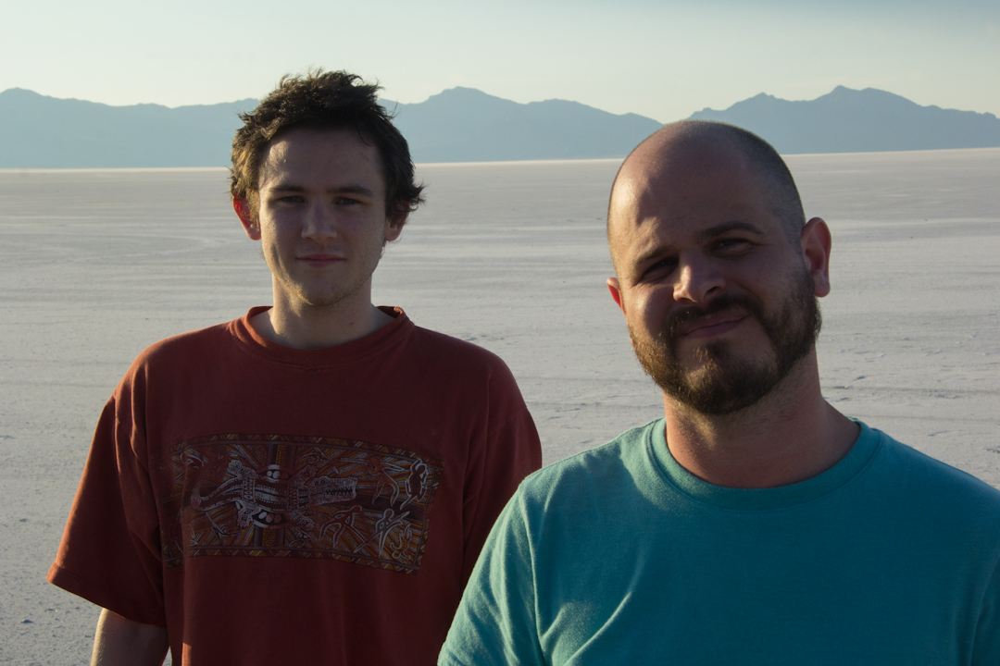
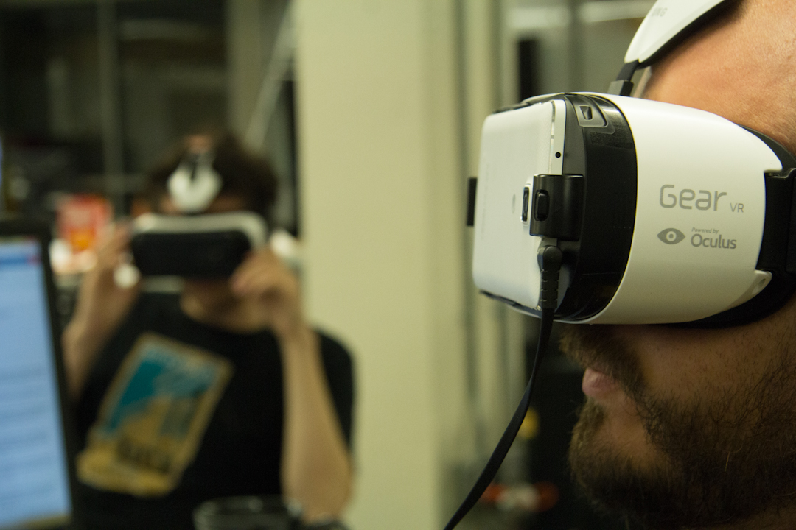
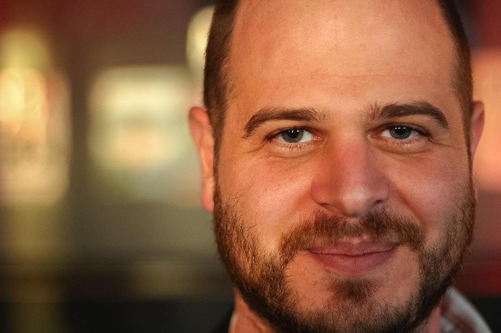
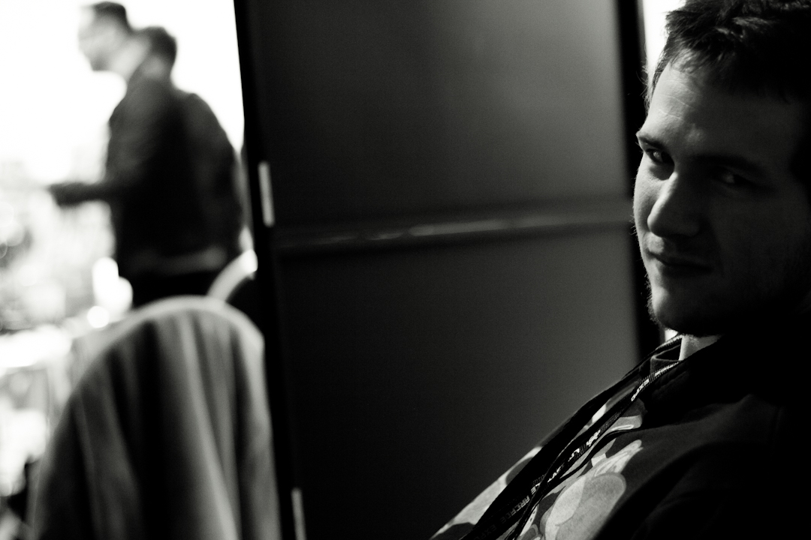
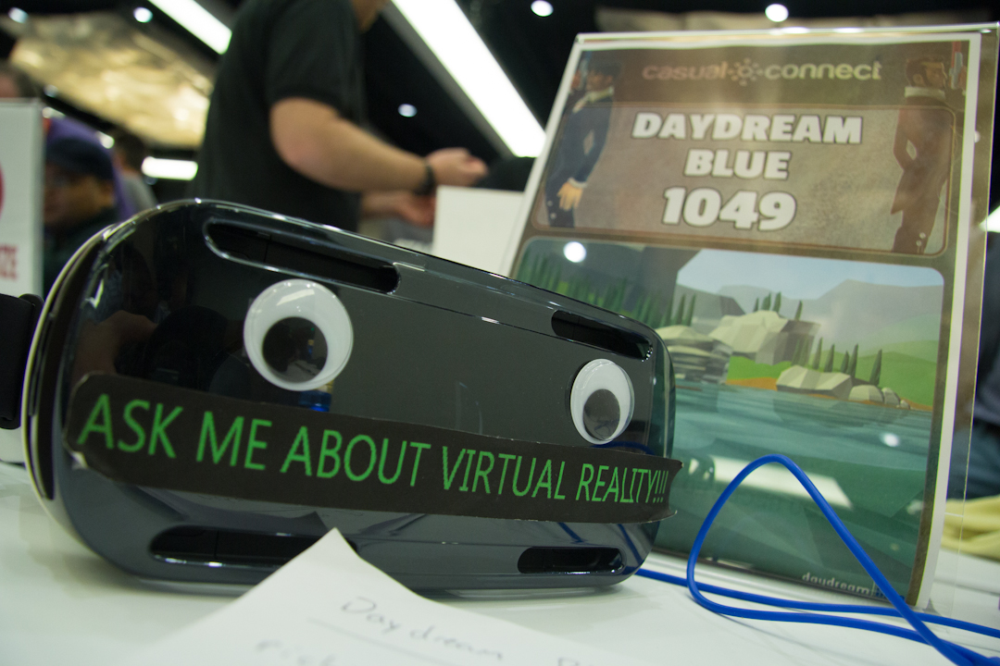
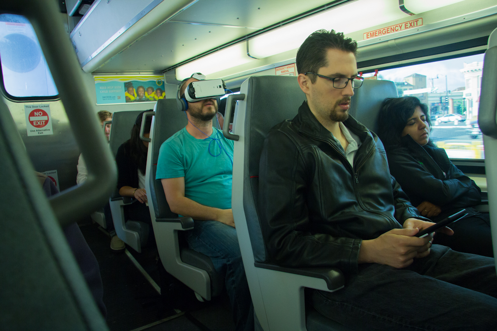
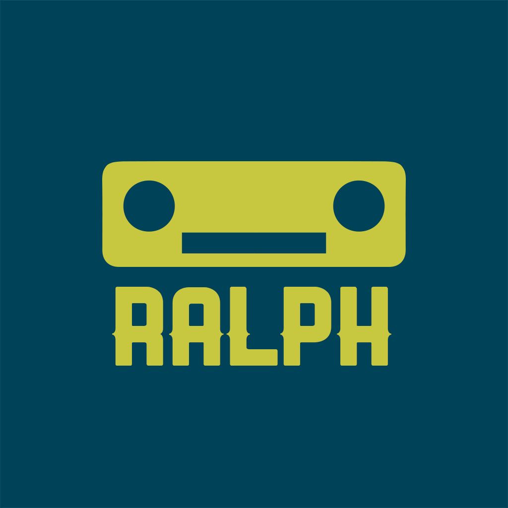
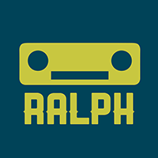

# 

## Factsheet

**Developer:**  
RalphVR

**Founding date:**  
June 16th, 2015

**Website:**  
[RalphVR.com][homepage]

**Press / Business contact:**  
[press-contact@company.com][contact]

**Social:**  
[twitter.com/ralphinvr][twitter]  
<!--[facebook.com/companyname][facebook]
[Skype](callto:companyskypename)-->

**Releases:**  
[Daydream Blue][example_project]

**Address:**  
Lexington, Kentucky

**Phone:**  
+01 (859) 699 6278

## Description

RalphVR creates Virtual Worlds to help people smile.

## History

### Beginning

Richie Hoagland and Shea Rembold founded RalphVR after Daydream Blue, their first virtual reality game, won Gold Prize in the 2015 Oculus Mobile VR Jam.  Wishing to pivot into the still-developing VR market, they  set out to build a new company focused on virtual reality and deep gameplay experience.

RalphVR is the result of their effort.  And RalphVR’s mission is to make people happy.    

## Projects

* [Daydream Blue][example_project]

## Videos

Learn about how we drove across the US to follow our dreams. [Video](https://www.youtube.com/watch?v=5bHpfxXK8b8 "RalphVR heads to California")  

<iframe src="//www.youtube.com/watch?v=5bHpfxXK8b8" frameborder="0" allowfullscreen></iframe>

 

## Images

download all screenshots & photos as ** [.zip (63 KB)](assets/images/images.zip "Images zip") **

## Logo & Icon

download logo files as ** [.zip (7 KB)]( assets/images/logo.zip "Logo & Icon zip") **

## Awards & Recognition

>*"Gold Prize Winner, 2015 Oculus MobileVR GameJam." - Daydream Blue, June 4, 2015

>*"2015 Participant in BoostVC Tech Accelerator" - August 3, 2015

>*"Indie Prize Showcase, 2015 Casual Connect." - Daydream Blue, August 11, 2015

<!--## Selected Articles

> * "Quote quote quote."  
-- *Person Name, [Website](http://www.website.com/)*

> * "More quotes."  
-- *Person name, [Site](http://geocities.blog.com/)*

## Additional Links

**Company Link #1**  
Link to your company, or some affiliate. Located [here](https://link)

**Company Link #2**  
Another of these. See [here](https://link)-->

## Team & Repeating Collaborator

**Richie Hoagland**  
[Co-Founder, CEO](https://link)

**Shea Rembold**  
[Co-founder, CTO](https://link)

**Jeff Hoagland**  
[Business and Creative Development](https://link)

**Shawn Hibbler**  
[Musician and Sound FX](https://link)

## Contact

**Inquiries**  
[richie@ralphvr.com][contact]

**Twitter**  
[twitter.com/ralphinvr][twitter]

<!--** Facebook**  
[facebook.com/companyname][facebook]-->

**Web**  
[ralphinvr.com][homepage]

<!--- =====================================================================  -->
<!--- Referenced links -->

[homepage]: http://ralphvr.com "RalphVR"

[contact]: mailto:richie@ralphvr.com

<!--- Social -->

[twitter]: https://twitter.com/ralphinvr
[facebook]: https://facebook.com/companyname
[skype]: callto:companyskypename

<!--- Projects  -->

[example_project]: projects/daydreamblue/
