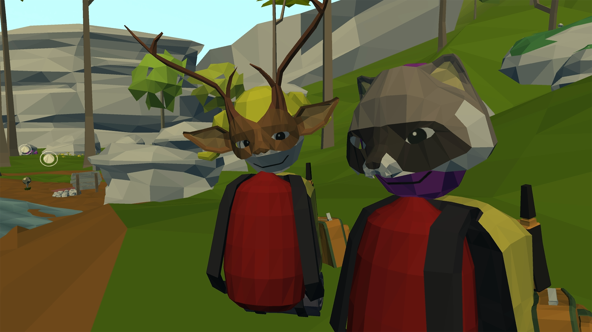

# 

## Factsheet

**Developer:**  
RalphVR

**Release Date:**  
TBA

**Platforms:**  
[GearVR](http://link)  
  

<!--**Website:**  
[companydomain.com/exampleproject](http://companydomain.com/exampleproject)-->

**Regular Price:**  
TBA

## Description

Daydream Blue is a dreamlike valley full of games and surprises supporting both solo and online play.

## History

A lake and a robot for you and your friends…
 
Such was the original idea for Daydream Blue.  It was 2015, and Richie Hoagland had a problem:  His new VR game wasn’t integrating the new technology as he’d like.  Frustrated, he longed to lie down in a sparse field, look up at the sky, and think--but he was trapped in an urban office.  So he did what any true developer would do...he built a green valley in virtual reality.  He put a sky overhead.  Then he strapped in, closed his eyes, and drifted away.  
 
‘This is it,’ he thought.  ‘This is the feeling of happiness I want to give others.”   

They called it Daydream Blue.  

Daydream Blue is a virtual world, a place where you can customize yourself and your place in it.  It’s a space to be explored and discovered either alone or with friends. A place to build a fire and catch some fish.  Or play some golf.  Play fetch with your robot.  Throw sticks at your friends.  Or just wish the clouds out of the sky.

Because in a dream, anything is possible.   

## Features

> * Online Multiplayer with Voice Chat from Avatar location
> * Craft new items, accessories and games
> * Form and create a malleable world  
> * Immersive time of day, wildlife, and more
> * Explore an ever-chaining environment
> * Fine tools, build, and play games and simulations with friends

## Videos

Demo video from the Oculus Mobile VR Jam! [Youtube](https://www.youtube.com/watch?v=QpPwqVy6j10"Jam Prototype Video")

<iframe src="//www.youtube.com/embed/QpPwqVy6j10" frameborder="0" allowfullscreen></iframe>

 

Demo video from the Oculus Mobile VR Jam! [Youtube](https://youtu.be/uEnzJYHbgAg"Jam Prototype Video")

<iframe src="//www.youtube.com/embed/uEnzJYHbgAg" frameborder="0" allowfullscreen></iframe>

## Images

download all screenshots & photos as ** [.zip (63 KB)](assets/images/images.zip "Images zip") **

## Logo & Icon

download logo files as ** [.zip (7 KB)]( assets/images/logo.zip "Logo & Icon zip") **

## Awards & Recognition

 > * "Gold Prize Winner, 2015 Oculus MobileVR GameJam." - June 4, 2015
 > * "Indie Prize Showcase, 2015 Casual Connect." - August 11, 2015

## Selected Articles

> * "Put a quote here, from someone who talked about your game."  
-- *Person Name, [Website](http://www.website.com/)*

> * "More quotes. Make sure to quote people properly! No trimming!"  
-- *Person name, [Site](http://geocities.blog.com/)*

<!--## Additional Links

**Company Link #1**  
A link to something related can go [here](https://link)

**Company Link #2**  
Another link like this goes [here](https://link) if you want.-->

## About Company

**Company Link #1**  
Link to Company Site [ralphvr.com](https://www.ralphvr.com)

## Example Project Credits

**Richie Hoagland*  
[Design](https://link)

**Shea Rembold**  
[Developer](https://link)

**Jeff Hoagland**  
[Business and Creative Development](https://link)

**Shawn Hibbler**  
[Musician and Sound FX](https://link)

**Amanda Wallace**  
[Concept Art](https://link)

## Contact

**Inquiries**  
[richie@ralphvr.com][contact]

**Twitter**  
[twitter.com/ralphinvr][twitter]

<!--** Facebook**  
[facebook.com/companyname][facebook]-->

**Web**  
[ralphvr.com][homepage]

<!--- =====================================================================  -->
<!--- Referenced links -->

[homepage]: http://ralphvr.com "RalphVR"

[contact]: mailto:richie@ralphvr.com

<!--- Social -->

[twitter]: https://twitter.com/ralphinvr
[facebook]: https://facebook.com/companyname
