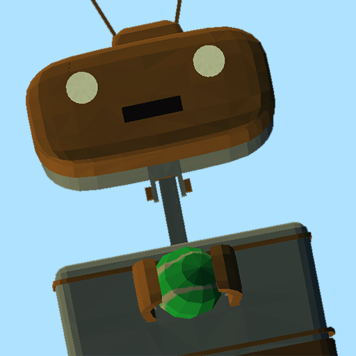

# 

## Factsheet

**Developer:**  
RalphVR

**Release Date:**  
Septemebr 24th, 2015

**Platforms:**  
GearVR 
  

**Website:**  
[www.daydreamblue.com](http://daydreamblue.com)

**Regular Price:**  
$9.99

## Description

Enter a magical valley full of mystery, surprise, and an awesome robot buddy in the Gold Winner of the Oculus Mobile VR Jam. You will discover recipes to craft exciting new items, frantically shoot UFO invaders at night, and play fetch with your adorable robot pal! But don’t go alone. Connect with your friends online in the first mutliplayer game with voice chat to ever be released on GearVR! and play games together, goof off around the fire, and show off your customized avatar. 

## History

A lake and a robot for you and your friends…
 
Such was the original idea for Daydream Blue.  It was 2015, and Richie Hoagland had a problem:  His new VR game wasn’t integrating the new technology as he’d like.  Frustrated, he longed to lie down in a sparse field, look up at the sky, and think--but he was trapped in an urban office.  So he did what any true developer would do...he built a green valley in virtual reality.  He put a sky overhead.  Then he strapped in, closed his eyes, and drifted away.  
 
‘This is it,’ he thought.  ‘This is the feeling of happiness I want to give others.”   

They called it Daydream Blue.  

Daydream Blue is a virtual world, a place where you can customize yourself and your place in it.  It’s a space to be explored and discovered either alone or with friends. A place to build a fire and catch some fish.  Or play some golf.  Play fetch with your robot. Or just wish the clouds out of the sky.

Because in a dream, anything is possible.   

## Features

> * Online Multiplayer with 3D spatialized Voice Chat and Room Invites - First ever on GearVR!
> * One awesome robot buddy to play with, take care of, and hang out with
> * AWESOME ROBOT BUDDY AI!!!
> * Crafting: Discover new items, games, and more!
> * Change the time of day in a customizable world
> * Two updates a month, open development with community input 
> * Immersive 3D spatialized soundscape using Oculus Audio SDK

## Videos

Latest trailer for Daydream Blue [youtube](https://youtu.be/hKVtW93JQ1g)

<iframe src="https://www.youtube.com/embed/hKVtW93JQ1g" frameborder="0" allowfullscreen></iframe>

<!-- 

Daydream Blue at Casual Connect! [Youtube](https://youtu.be/uEnzJYHbgAg"Jam Prototype Video")

<iframe src="//www.youtube.com/embed/uEnzJYHbgAg" frameborder="0" allowfullscreen></iframe>-->

## Images

download all screenshots & photos as ** [.zip (63 KB)](assets/images/images.zip "Images zip") **

## Logo & Icon

download logo files as ** [.zip (7 KB)]( assets/images/logo.zip "Logo & Icon zip") **

## Awards & Recognition

 > * "Gold Prize Winner, 2015 Oculus MobileVR GameJam." - June 4, 2015
 > * "Indie Prize Showcase, 2015 Casual Connect." - August 11, 2015
 > * "Smithsonian Arcade, 2016, Washington DC." - January 16th, 2016

## Selected Articles

> * "Daydream Blue was one of eight projects in the jam to get a perfect score from me."  
-- *Brad Herman, [Website](http://www.bradherman.com/home/hitchhikers-guide-to-the-metaverse/theoculusmobilevrjam2015-thoughtsfromajudge/)*

> * "I love this little game, and can't wait to see what else the developer adds!"  
-- *GearVR Mini Game Reviews, [Website](http://gearvrreviews.blogspot.com/2015/05/gearvr-jam-2015-appexperiences-my.html)*

> * "This is a game that rewards you for your curiosity" Daydram BLue named as one of Best Samsung Gear VR apps and games
-- *Trusted Reviews, [Website](http://www.trustedreviews.com/best-samsung-gear-vr-apps_round-up_Page-14)*

<!--## Additional Links

**Company Link #1**  
A link to something related can go [here](https://link)

**Company Link #2**  
Another link like this goes [here](https://link) if you want.-->

## About Company

**RalphVR Link**  
[ralphvr.com](https://www.ralphvr.com)

## Project Credits

**Richie Hoagland**   
Design

**Shea Rembold**  
Developer

**Jeff Hoagland**  
Producer

**Shawn Hibbler**  
Musician

**Amanda Wallace**  
Concept Art

## Contact

**Inquiries**  
[richie@ralphvr.com][contact]

**Twitter**  
[twitter.com/ralphinvr][twitter]

** Facebook**  
[facebook.com/daydreamblue][facebook]

**Web**  
[ralphvr.com][homepage]

<!--- =====================================================================  -->
<!--- Referenced links -->

[homepage]: http://ralphvr.com "RalphVR"

[contact]: mailto:richie@ralphvr.com

<!--- Social -->

[twitter]: https://twitter.com/ralphinvr
[facebook]: https://www.facebook.com/Daydream-Blue-1619781554938796
