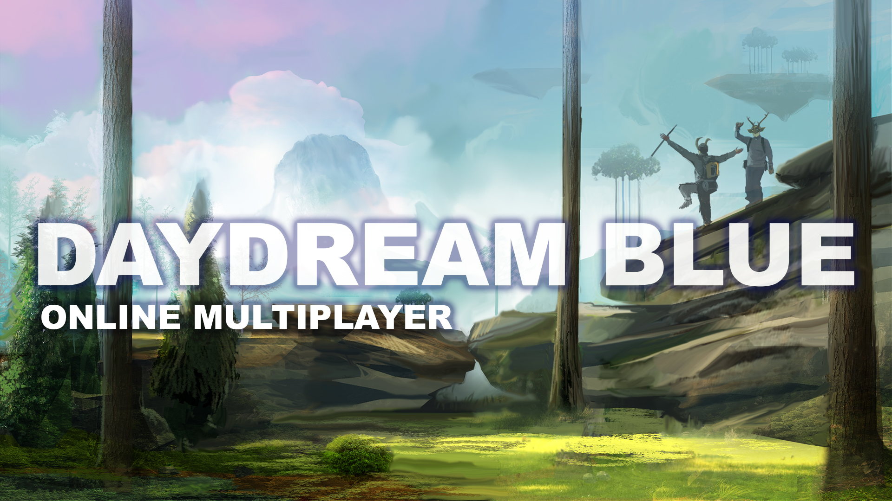
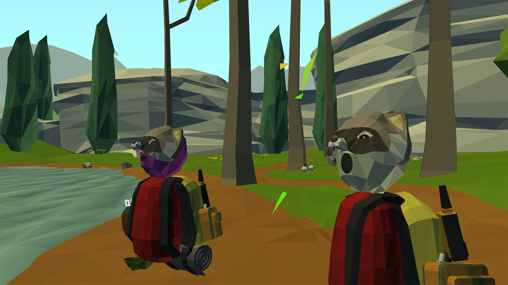

# 

## Factsheet

**Developer:**  
RalphVR

**Release Date:**  
Septemebr 24th, 2015

**Platforms:**  
GearVR 
  

**Website:**  
[www.daydreamblue.com](http://daydreamblue.com)

**Regular Price:**  
$9.99

## Description

Enter a magical valley full of mystery, surprise, and an awesome robot buddy in the Gold Winner of the Oculus Mobile VR Jam. You will discover recipes to craft exciting new items, frantically shoot UFO invaders at night, and play fetch with your adorable robot pal! But don’t go alone. Connect with your friends online in the first multiplayer game with voice chat to ever be released on GearVR! and play games together, goof off around the fire, and show off your customized avatar. 

## History

A lake and a robot for you and your friends…
 
In early 2015 Richie and Shea started building a game for the Oculus Mobile VR Jam. They were about to both be unemployed, and so they decided to spend the last month of time they would be working together to create one last game. Richie and Shea bet it all on the jam, not to win but to put their hearts into something they were proud of, regardless of the outcome. 

For almost a month Shea and Richie developed the core environment and mechanics, preparing for the first milestone in the jam.  But as the first deadline drew cloose, it nagged Richie and Shea that they were not taking advantage of the unique potential of VR. And perhaps more importantly, it just didn't feel like the game they really wanted to develop.

So only days before the first submission, they built a prototype consisting of a grass field and a blue sky. Daydream Blue was born. 

Richie and Shea barely made the first deadline with one concept art work for their new game. But in the end, they poured their hearts into developing Daydream Blue. The last day of submission, they said goodby and walked out of the office. Shea went out west to travel and Richie spent time looking for work. A month later, and Daydream BLue was named Gold WInner of the Oculus Jam. With $100,000, Shea and Richie were finnaly able to begin work on a full fledged game. 

Daydream Blue is a virtual world, a place where you can customize yourself and your place in it.  It’s a space to be explored and discovered either alone or with friends. A place to build a fire and catch some fish.  Or play some golf.  Play fetch with your robot. Or just wish the clouds out of the sky. THe game has been in development since April 2015.

Daydream BLue is available on GearVR, but development is not stopping. The team is continually expanding the game, as well as building out support for different devices. The dream of Richie and Shea is to develop the first cross platform online multiplayer VR game, allowing people to share moments, play games, and explore, across the world, and across devices!

## Features

> * Online Multiplayer with 3D spatialized Voice Chat and Room Invites - First ever on GearVR!
> * One awesome robot buddy to play with, take care of, and hang out with
> * AWESOME ROBOT BUDDY AI!!!
> * Crafting: Discover new items, games, and more!
> * Change the time of day in a customizable world
> * Two updates a month, open development with community input 
> * Immersive 3D spatialized soundscape using Oculus Audio SDK

## Videos

Latest trailer for Daydream Blue [youtube](https://youtu.be/hKVtW93JQ1g)

<iframe src="https://www.youtube.com/embed/hKVtW93JQ1g" frameborder="0" allowfullscreen></iframe>

https://www.youtube.com/watch?v=L8lu7jFlW7Q

 

Multiplayer Video [youtube](https://youtu.be/6zlghauXfq0)

<iframe src="https://www.youtube.com/embed/6zlghauXfq0" frameborder="0" allowfullscreen></iframe>

 

Gameplay and Multiplayer Video [youtube](https://youtu.be/sTMh1eokTog)

<iframe src="https://www.youtube.com/embed/sTMh1eokTog" frameborder="0" allowfullscreen></iframe>

<!--Daydream Blue at Casual Connect! [Youtube](https://youtu.be/uEnzJYHbgAg"Jam Prototype Video")

<iframe src="//www.youtube.com/embed/uEnzJYHbgAg" frameborder="0" allowfullscreen></iframe>-->

## Images

download all screenshots & photos as ** [.zip (63 KB)](assets/images/images.zip "Images zip") **

## Logo & Icon

download logo files as ** [.zip (7 KB)]( assets/images/logo.zip "Logo & Icon zip") **

## Awards & Recognition

 > * "Gold Prize Winner, 2015 Oculus MobileVR GameJam." - June 4, 2015
 > * "Indie Prize Showcase, 2015 Casual Connect." - August 11, 2015
 > * "Smithsonian Arcade, 2016, Washington DC." - January 16th, 2016

## Selected Articles

> * "Daydream Blue was one of eight projects in the jam to get a perfect score from me."  
-- *Brad Herman, [Website](http://www.bradherman.com/home/hitchhikers-guide-to-the-metaverse/theoculusmobilevrjam2015-thoughtsfromajudge/)*

> * "I love this little game, and can't wait to see what else the developer adds!"  
-- *GearVR Mini Game Reviews, [Website](http://gearvrreviews.blogspot.com/2015/05/gearvr-jam-2015-appexperiences-my.html)*

> * "This is a game that rewards you for your curiosity" Daydram BLue named as one of Best Samsung Gear VR apps and games
-- *Trusted Reviews, [Website](http://www.trustedreviews.com/best-samsung-gear-vr-apps_round-up_Page-14)*

> * "Talking With the Creators of the First True Mobile and Social Game, in VR"
-- *UploadVR, [Website](http://uploadvr.com/i-interviewed-the-creators-of-daydream-blue-in-vr/)*

## Additional Links

**Gamasutra Article about how we streaming Daydream BLue at 60fps**  
There is currently n solution for 60fps streaming of GearVR games, but we offer up how we do it for Daydream Blue [here](http://gamasutra.com/blogs/RichieHoagland/20151026/257254/How_we_stream_our_GearVR_game_without_impacting_performance.php)

**Gamasutra Article on how we brought online multiplayer and positional voice chat to GearVR**  
We were the first game on GearVR with online multiplayer and positional voice chat. [here](http://gamasutra.com/blogs/RichieHoagland/20151216/262034/3_biggest_hurdles_faced_in_bringing_online_multiplayer_to_GearVR.php)

## About Company

**RalphVR Link**  
[ralphvr.com](https://www.ralphvr.com)

## Project Credits

**Richie Hoagland**   
Design

**Shea Rembold**  
Developer

**Jeff Hoagland**  
Producer

**Shawn Hibbler**  
Musician

**Amanda Wallace**  
Concept Art

## Contact

**Inquiries**  
[richie@ralphvr.com][contact]

**Twitter**  
[twitter.com/ralphinvr][twitter]

** Facebook**  
[facebook.com/daydreamblue][facebook]

**Web**  
[ralphvr.com][homepage]

<!--- =====================================================================  -->
<!--- Referenced links -->

[homepage]: http://ralphvr.com "RalphVR"

[contact]: mailto:richie@ralphvr.com

<!--- Social -->

[twitter]: https://twitter.com/ralphinvr
[facebook]: https://www.facebook.com/Daydream-Blue-1619781554938796
